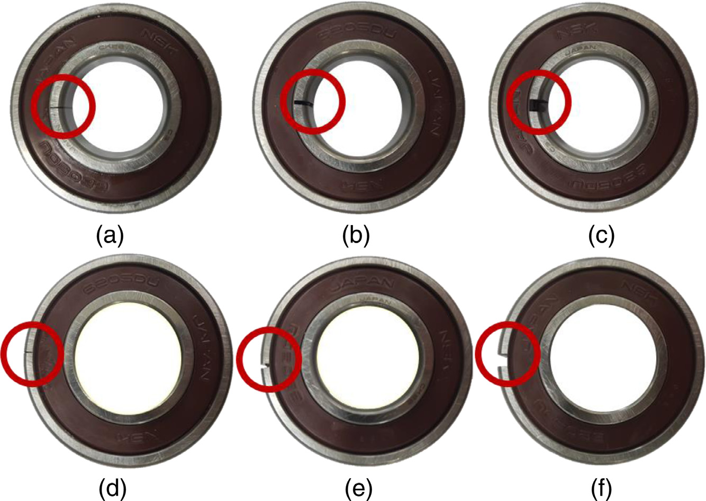
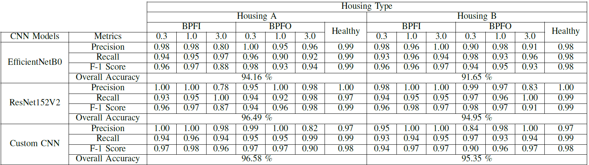

# ⚙️ Machine Fault Monitoring using Spectral Correlation and Deep Learning

This project presents a robust deep learning approach to diagnose **bearing faults in rotating machinery** using **vibration signal processing** and **Spectral Correlation Density (SCD)** images. Early fault detection in bearings is vital to ensure equipment reliability, reduce maintenance costs, and prevent catastrophic failures in industrial systems.

---

## 📂 Dataset

We used the publicly available dataset:

- 🔗 **[Mendeley Dataset Link](https://data.mendeley.com/datasets/ztmf3m7h5x/6)**
- 📄 **Dataset Paper:**  
  _“Vibration, Acoustic, Temperature, and Motor Current Dataset of Rotating Machine Under Varying Load Conditions for Fault Diagnosis”_  
  DOI: [10.17632/ztmf3m7h5x.6](https://doi.org/10.17632/ztmf3m7h5x.6)  
  Published: 8 February 2023, Version 6

---

## 📊 Problem Overview

Traditional signal processing techniques like **Fast Fourier Transform (FFT)** often struggle with the **non-stationary nature** of vibration signals. This project addresses those limitations by leveraging:

- **Cyclostationary properties** of vibration signals
- **SCD image generation** from time-series data
- **CNN-based image classification** for fault detection

---

## 🔍 Methodology

We developed and tested **three deep learning models** to classify **seven bearing fault conditions** under **three load settings** (0 Nm, 2 Nm, 4 Nm) across **two machine housings (A and B)**.

### 📌 Models Used

| Model             | Description                             |
|------------------|-----------------------------------------|
| Custom CNN        | Lightweight 4-layer convolutional model |
| ResNet152V2       | Deep residual network with skip-connections |
| EfficientNetB0    | Lightweight model optimized for edge deployment |

### 📈 Performance Summary

## 🖼️ Results Snapshot

  
*Figure: Accuracy comparison of all models on both housings under varying loads.*

---

## 🧠 Key Contributions

- 🌀 Transformed vibration time-series into **SCD-based spectral images** for enhanced interpretability.
- 🔍 Demonstrated CNNs’ effectiveness in **complex, noisy industrial datasets**.
- 🧾 Delivered practical insights for **deploying condition monitoring solutions** on edge hardware.

---

## ⚒️ Technologies Used

- Python  
- TensorFlow & Keras  
- OpenCV, NumPy, Matplotlib  
- SciPy Signal Processing  
- Jupyter Notebooks

---

## 🏁 Conclusion

This project provides a **highly accurate and scalable solution** for bearing fault classification. The use of SCD images combined with CNN architectures delivers a powerful framework for **real-time, edge-compatible monitoring systems** in industrial environments.

> The models' robustness across different housings and load settings confirms their generalization capability and readiness for real-world deployment.

---

## 📎 Citation

If you use this project or the dataset in your research, please cite the dataset paper:  
**DOI:** [10.17632/ztmf3m7h5x.6](https://doi.org/10.17632/ztmf3m7h5x.6)

---

*Developed by Dilshara Herath — AI for Industrial Reliability & Safety*
